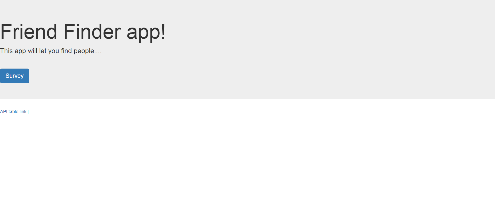

# FriendFinder
# About / Synopsis

This app allows the user to answer 10 questions.  Base upon those responses, a match will be found within a predefined "friend" list.  The friend will be displayed to the user along with an image if one is available.

# Table of contents

-Git Hub link: https://github.com/nickvenn/FriendFinder.git 
-Heroku link: https://lit-beach-57962.herokuapp.com/

# Installation

- npm install express
- npm install path
- npm install body-parser

## Screenshots
## Home Page

## Survey Page

## Submit Button

